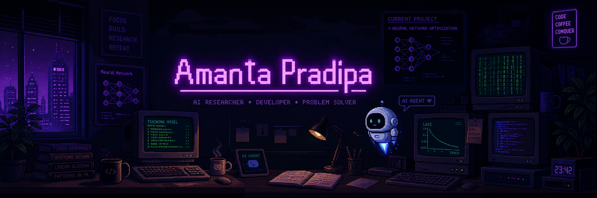
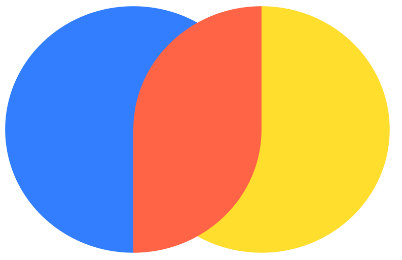

### Hey there, I'm Amanta

**Computer Science student @ Universitas Mataram**
Exploring the frontier of AI Agents and Open Source ecosystem.

I am an AI and Agent Enthusiast passionate about researching open-source ecosystems. I spend a lot of time exploring various repositories to understand emerging patterns and then building my own modular agent skills. My goal is to create tools that help bridge the gap between complex AI research and practical, developer-centric implementations.

  
  

---

## Research & Focus

- **AI Agent Research** — Constant exploration of open-source agentic frameworks and reasoning patterns.
- **Agentic Skill Building** — Developing modular skills that can be integrated into different AI environments.
- **Open Source Infrastructure** — Researching and building upon the latest open-weights models to keep AI accessible.
- **Practical Automation** — Applying agentic workflows to solve real-world development and architectural challenges.

---

## Agent Skills (Pro Max Series)

I develop a series of modular agentic skills designed to enhance development workflows. These are research-driven datasets and logic kernels for specialized AI interactions.

| Skill                      | Focus Area                                                              | Status                 |
| :------------------------- | :---------------------------------------------------------------------- | :--------------------- |
| **Agentic Workflow** | Multi-agent coordination and task orchestration patterns.               | In Development         |
| **Backend Arch**     | Production-grade server architecture and system design rules.           | In Development         |
| **QA Pro Max**       | Automated testing strategies, locator patterns, and CI/CD optimization. | In Development         |
| **Deep Learning**    | Neural network architectures and training pipeline best practices.      | In Development         |
| **Data/ML Pipeline** | End-to-end data processing and model deployment workflows.              | In Development         |
| **UI/UX Pro Max**    | Design systems, accessibility, and modern interface patterns.           | *Research Reference* |

*Note: UI/UX Pro Max is utilized as a research reference for analyzing industry-standard design patterns.*

---

## Tech Stack

### Frontend

### Backend & Runtime

### AI & Tooling

 
   

### DevOps & Services

 

---

## My AI Stack

I focus my research and development on **Google's Gemma family**, specifically leveraging **Gemma 4** for its balance of efficiency and reasoning capability.

### Primary Model

- **Gemma 4** (Scout & Maverick): My main driver for complex multi-step agents and long-context reasoning research.

### API & Infrastructure

To keep development accessible and sustainable, I utilize:

- **Google AI Studio** — Primary source for high-performance free API access.
- **OpenRouter** — For unified model routing and experimenting with free-tier open models.
- **Ollama** — For local execution and private research environments.

---

## Current Projects

### Cubeno Education

> **LMS focused on IoT & Technology Modules**
> A platform designed to provide structured learning paths for technical education. I'm currently researching how AI agents can assist in content generation and student progress tracking within this ecosystem.

`Next.js` `Node.js` `Python` `AI-assisted learning`

---

### Ascent Studio

> **Production-Ready App Templates & Custom SaaS**
> A studio focused on developing high-quality foundations for web and mobile applications. It serves as my testing ground for integrating agentic skills into real-world SaaS architectures.

`React` `Next.js` `React Native` `Node.js` `Agentic Skills`

---

## Highlights

| Topic                         | Description                                                                      |
| ----------------------------- | -------------------------------------------------------------------------------- |
| **Juara Vibe Coding**   | Upcoming Participant in Google's Vibe Coding Season 1.                           |
| **Agentic Research**    | Deep diving into open-source repos to extract and implement new agent behaviors. |
| **MineHive Bot**        | Former Developer/Admin for automated systems on community servers.               |
| **Hytale Modding**      | Java-based plugin and mod development for future game mechanics.                 |
| **Juara GCP Season 12** | Participant in Google Cloud's Indonesian developer community challenges.         |

---

## Performance & Stats

  
  

### Most Used Languages

---

## Connect with Me

